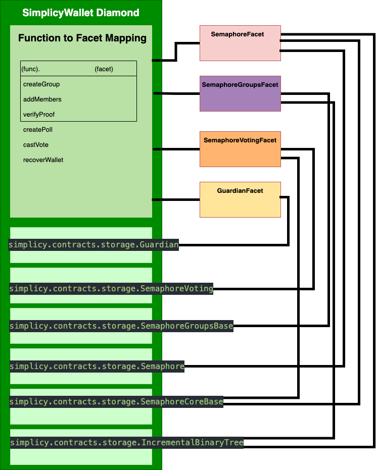

# </img>
**A library for secure smart contract development.** Build on a solid foundation of community-vetted code.

 * Implementations of Diamond standard based on [EIP-2535: Diamonds, Multi-Facet Proxy](https://eips.ethereum.org/EIPS/eip-2535).
 * Implementation of [Diamond storage pattern](https://medium.com/1milliondevs/new-storage-layout-for-proxy-contracts-and-diamonds-98d01d0eadb)

## Simplicy Diamond Storage Pattern


## Circuit
Compile circuits
```bash
yarn compile:circuit
```

## Development

Install dependencies via Yarn:

```bash
yarn install
```

Setup Husky to format code on commit:

```bash
yarn prepare
```

Link local packages and install remaining dependencies via Lerna:

```bash
yarn lerna bootstrap
```

Compile contracts via Foundry:
```bash
forge build
```

Compile contracts via Hardhat:

```bash
yarn compile
```

Automatically upgrade dependencies with yarn-up:

```bash
yarn upgrade-dependencies
```

## Deployment
Deploy facets
```bash
yarn deploy:facets --facets '[{"name": "WalletFactoryFacet"}, {"name": "SemaphoreFacet"}, {"name": "SemaphoreVotingFacet"}]'
```

### Testing

Test contracts with Foundry using Fuzzing
```bash
forge test
```

Test contracts with Hardhat and generate gas report using `hardhat-gas-reporter`:

```bash
yarn test
```

Generate a code coverage report using `solidity-coverage`:

```bash
yarn coverage
```

### Publication

Publish packages via Lerna:

```bash
yarn lerna-publish
```